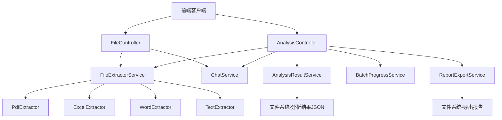
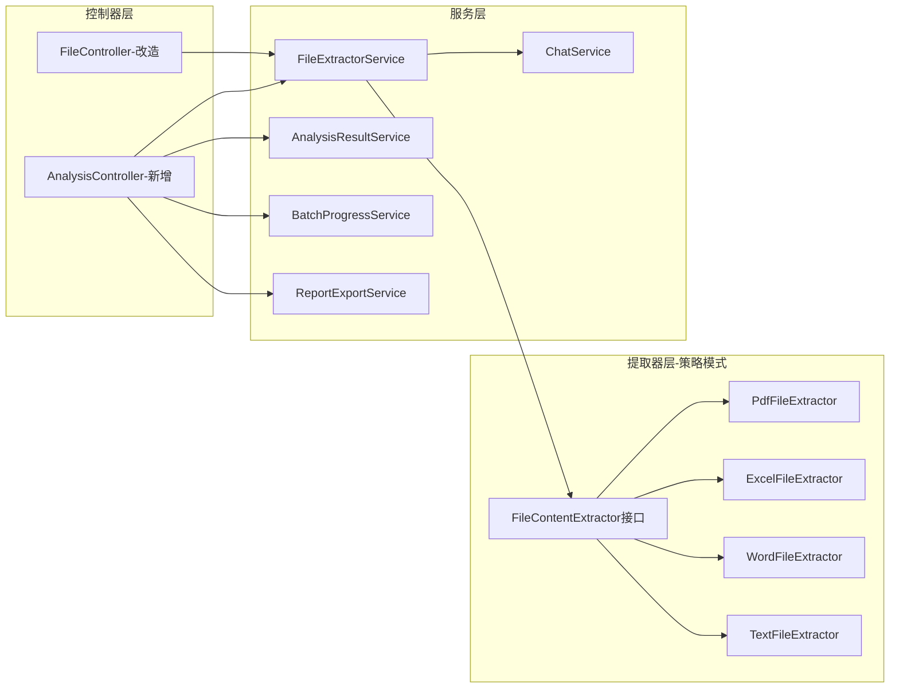
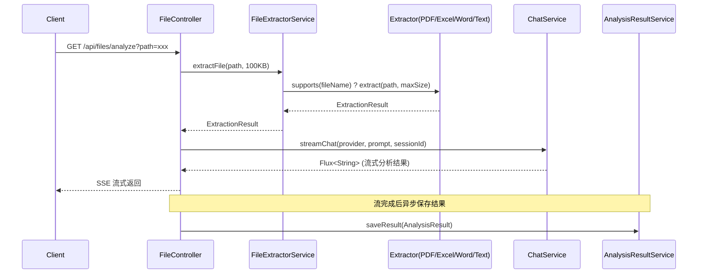
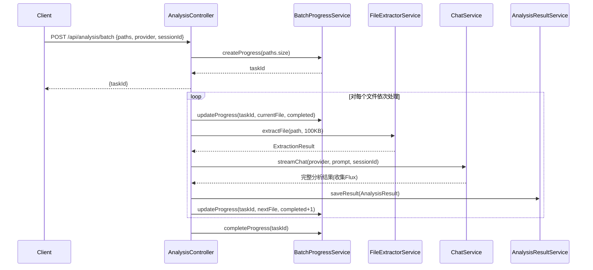
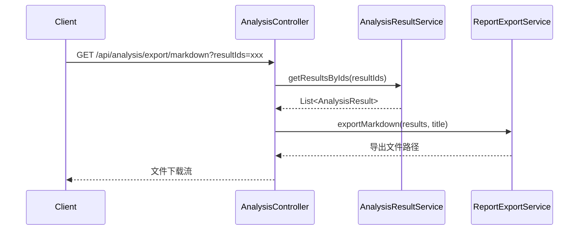

# 技术设计文档 - 强化文件分析能力

## 文档信息
| 项目 | 内容 |
|------|------|
| 特性名称 | enhanced-file-analysis |
| 版本 | 1.0 |
| 创建日期 | 2025-04-25 |
| 状态 | 草稿 |

## 1. 架构概览

### 1.1 系统上下文

本设计在现有 Spring Boot + Spring AI 平台基础上，新增文件内容提取层、批量分析调度层、结果存储层和报告导出层，与现有 FileController 和 ChatService 协同工作。



### 1.2 组件架构

采用策略模式实现文件内容提取器，通过接口统一抽象不同格式的解析逻辑，新增控制器独立承载批量分析、结果管理和报告导出功能，保持现有 FileController 的兼容性。



### 1.3 技术选型

| 技术领域 | 选型 | 理由 |
|----------|------|------|
| PDF 文本提取 | Apache PDFBox 3.0.x | 成熟开源、纯 Java、支持中文、无本地依赖 |
| Excel 解析 | Apache POI 5.2.x | 业界标准、支持 xlsx/xls、支持大文件 SAX 模式 |
| Word 解析 | Apache POI 5.2.x (XWPF) | 同一库兼顾 Excel 和 Word，减少依赖 |
| PDF 报告生成 | OpenPDF 2.0.x | 开源免费（LGPL）、支持中文字体嵌入、iText 5 的社区分支 |
| 结果存储 | 本地文件系统 JSON | 轻量级、无需数据库、与项目现有风格一致 |
| 批量进度跟踪 | ConcurrentHashMap + UUID | 内存存储、简单高效、适合单实例部署 |

## 2. 核心组件设计

### 2.1 FileContentExtractor（文件内容提取器接口）

#### 2.1.1 职责
定义文件内容提取的统一抽象接口，所有格式提取器实现此接口。采用策略模式，由 FileExtractorService 根据文件扩展名分派到对应提取器。

#### 2.1.2 接口定义

```java
public interface FileContentExtractor {
    /**
     * 判断是否支持该文件格式
     */
    boolean supports(String fileName);

    /**
     * 提取文件内容为可分析的文本
     * @param filePath 文件绝对路径
     * @param maxSize 最大提取字节数（超过截断）
     * @return 提取结果
     */
    ExtractionResult extract(Path filePath, int maxSize) throws IOException;
}
```

```java
public class ExtractionResult {
    private final boolean success;
    private final String content;       // 提取的文本内容
    private final String contentType;   // 内容类型标识：text / structured-text / image-base64
    private final String errorMessage;  // 失败时的错误信息
    private final Map<String, Object> metadata; // 元数据（页数、工作表名等）
}
```

#### 2.1.3 提取器实现

**PdfFileExtractor**：
- 使用 PDFBox 的 `PDDocument` 加载 PDF
- 遍历所有页面，通过 `PDFTextStripper` 提取文本
- 若提取文本为空，返回"扫描件无法提取"提示
- metadata 中记录总页数

**ExcelFileExtractor**：
- 使用 POI 的 `WorkbookFactory.create()` 自动识别 xlsx/xls
- 遍历所有 Sheet，提取工作表名称、列头（首行）、数据行
- 对数值列计算基本统计（min/max/avg/count）
- 输出为结构化文本格式，便于 AI 理解
- metadata 中记录工作表数量、总行数

**WordFileExtractor**：
- 使用 POI 的 `XWPFDocument` 加载 docx
- 遍历段落，保留标题层级（基于 `XWPFParagraph.getStyle()`）
- 遍历表格，转换为 Markdown 表格格式
- metadata 中记录段落数、表格数

**TextFileExtractor**：
- 兜底提取器，处理现有文本格式（JSON/CSV/MD/PY/TEX）
- 直接 `Files.readString()`，与现有逻辑一致

### 2.2 FileExtractorService（文件提取调度服务）

#### 2.2.1 职责
根据文件名分派到对应的 FileContentExtractor，统一管理提取器注册和调用。

#### 2.2.2 接口定义

```java
@Service
public class FileExtractorService {
    private final List<FileContentExtractor> extractors;

    /**
     * 根据文件名获取合适的提取器并执行提取
     */
    public ExtractionResult extractFile(Path filePath, int maxSize) throws IOException;

    /**
     * 判断文件是否为可提取文本的格式（非纯二进制如 .pt/.pth）
     */
    public boolean isExtractable(String fileName);
}
```

### 2.3 AnalysisResultService（分析结果存储服务）

#### 2.3.1 职责
将 AI 分析结果以 JSON 格式持久化到本地文件系统，提供查询接口。

#### 2.3.2 接口定义

```java
@Service
public class AnalysisResultService {
    /**
     * 保存分析结果
     */
    void saveResult(AnalysisResult result);

    /**
     * 查询指定文件的分析结果列表
     */
    List<AnalysisResult> getResultsByFile(String filePath);

    /**
     * 查询所有分析结果（分页）
     */
    PageResult<AnalysisResult> getAllResults(int page, int size);

    /**
     * 根据结果ID列表批量获取
     */
    List<AnalysisResult> getResultsByIds(List<String> resultIds);
}
```

#### 2.3.3 数据模型

```java
public class AnalysisResult {
    private String id;              // UUID
    private String filePath;        // 被分析的文件相对路径
    private String fileName;        // 文件名
    private String provider;        // AI 模型提供者
    private String sessionId;       // 会话标识
    private LocalDateTime analyzedAt; // 分析时间
    private String content;         // AI 分析结果全文
    private long fileSize;          // 文件大小
    private String fileCategory;    // 文件类别
}
```

#### 2.3.4 存储结构

```
{base-dir}/.analysis-results/
  ├── {file-path-hash}/
  │   ├── {uuid-1}.json
  │   └── {uuid-2}.json
  └── index.json    // 全局索引（文件路径 → 结果ID列表）
```

### 2.4 BatchProgressService（批量分析进度服务）

#### 2.4.1 职责
管理批量分析任务的进度状态，基于内存存储（ConcurrentHashMap），以 UUID 为任务标识。

#### 2.4.2 接口定义

```java
@Service
public class BatchProgressService {
    /**
     * 创建新的批量任务进度
     */
    String createProgress(int totalCount);

    /**
     * 更新进度（完成一个文件）
     */
    void updateProgress(String taskId, String currentFile, int completedCount);

    /**
     * 标记任务完成
     */
    void completeProgress(String taskId);

    /**
     * 标记任务失败
     */
    void failProgress(String taskId, String error);

    /**
     * 查询进度
     */
    BatchProgress getProgress(String taskId);
}
```

#### 2.4.3 数据模型

```java
public class BatchProgress {
    private String taskId;
    private int totalCount;
    private int completedCount;
    private String currentFile;
    private String status;      // RUNNING / COMPLETED / FAILED
    private String errorMessage;
    private LocalDateTime startTime;
    private LocalDateTime endTime;
}
```

### 2.5 ReportExportService（报告导出服务）

#### 2.5.1 职责
将分析结果导出为 Markdown 或 PDF 格式的报告文件。

#### 2.5.2 接口定义

```java
@Service
public class ReportExportService {
    /**
     * 导出为 Markdown 报告
     * @return 导出文件的相对路径
     */
    String exportMarkdown(List<AnalysisResult> results, String reportTitle);

    /**
     * 导出为 PDF 报告
     * @return 导出文件的相对路径
     */
    String exportPdf(List<AnalysisResult> results, String reportTitle);
}
```

#### 2.5.3 Markdown 导出逻辑
- 生成报告头：标题、生成时间
- 遍历每个 AnalysisResult，生成二级标题（文件名）+ 元信息（分析时间、AI 模型）+ 分析内容
- 写入 `{base-dir}/.analysis-reports/{timestamp}-{title}.md`

#### 2.5.4 PDF 导出逻辑
- 使用 OpenPDF 创建文档
- 注册中文字体（从系统字体或内嵌资源加载 SimHei/SimSun）
- 生成报告标题页、目录页
- 每个 AnalysisResult 生成一个章节
- 写入 `{base-dir}/.analysis-reports/{timestamp}-{title}.pdf`

### 2.6 AnalysisController（分析控制器-新增）

#### 2.6.1 职责
承载批量分析、结果查询、报告导出的 API 端点，与现有 FileController 分离，保持 API 兼容性。

## 3. API 设计

### 3.1 新增 API 端点

| 方法 | 路径 | 描述 | 请求参数 | 响应 |
|------|------|------|----------|------|
| POST | `/api/analysis/batch` | 批量分析文件 | Body: `{paths: string[], provider: string, sessionId: string}` | `{taskId: string}` |
| GET | `/api/analysis/batch/progress` | 查询批量分析进度 | `taskId: string` | `BatchProgress` JSON |
| GET | `/api/analysis/batch/result` | 获取批量分析结果 | `taskId: string` | `{results: [{fileName, content, error}]}` |
| GET | `/api/analysis/results` | 查询所有分析结果 | `page: int, size: int` | `PageResult<AnalysisResult>` |
| GET | `/api/analysis/results/file` | 查询指定文件的分析结果 | `path: string` | `List<AnalysisResult>` |
| GET | `/api/analysis/export/markdown` | 导出 Markdown 报告 | `resultIds: string[], title: string` | 文件下载流 |
| GET | `/api/analysis/export/pdf` | 导出 PDF 报告 | `resultIds: string[], title: string` | 文件下载流 |

### 3.2 修改的 API 端点

| 方法 | 路径 | 变更描述 |
|------|------|----------|
| GET | `/api/files/content` | PDF 文件从返回"二进制文件"占位改为返回提取的文本内容；新增 Excel/Word 格式的内容返回 |
| GET | `/api/files/analyze` | PDF 文件从拒绝分析改为提取文本后分析；新增 Excel/Word 格式的分析支持 |
| GET | `/api/files` | 文件列表 category 新增 "excel"、"word" 标识 |

## 4. 数据模型

### 4.1 AnalysisResult（分析结果）

| 字段 | 类型 | 描述 |
|------|------|------|
| id | String (UUID) | 唯一标识 |
| filePath | String | 被分析文件的相对路径 |
| fileName | String | 文件名 |
| provider | String | AI 模型提供者 |
| sessionId | String | 会话标识 |
| analyzedAt | LocalDateTime | 分析完成时间 |
| content | String | AI 分析结果全文 |
| fileSize | long | 原始文件大小（字节） |
| fileCategory | String | 文件类别（json/csv/pdf/excel/word/markdown/python/latex/image） |

### 4.2 BatchProgress（批量分析进度）

| 字段 | 类型 | 描述 |
|------|------|------|
| taskId | String (UUID) | 批量任务唯一标识 |
| totalCount | int | 总文件数 |
| completedCount | int | 已完成文件数 |
| currentFile | String | 当前正在分析的文件名 |
| status | String | 状态：RUNNING / COMPLETED / FAILED |
| errorMessage | String | 失败时的错误信息 |
| startTime | LocalDateTime | 任务开始时间 |
| endTime | LocalDateTime | 任务结束时间 |

### 4.3 ExtractionResult（提取结果）

| 字段 | 类型 | 描述 |
|------|------|------|
| success | boolean | 是否提取成功 |
| content | String | 提取的文本内容 |
| contentType | String | 内容类型：text / structured-text / image-base64 |
| errorMessage | String | 失败时的错误信息 |
| metadata | Map<String, Object> | 元数据（页数、工作表数等） |

### 4.4 BatchAnalysisRequest（批量分析请求）

| 字段 | 类型 | 描述 |
|------|------|------|
| paths | List<String> | 文件路径列表（最多20个） |
| provider | String | AI 模型提供者（默认 deepseek） |
| sessionId | String | 会话标识 |

### 4.5 BatchAnalysisItemResult（单文件批量分析结果）

| 字段 | 类型 | 描述 |
|------|------|------|
| filePath | String | 文件路径 |
| fileName | String | 文件名 |
| success | boolean | 是否分析成功 |
| content | String | 分析结果内容（成功时） |
| error | String | 错误信息（失败时） |
| resultId | String | 分析结果ID（成功时，用于后续导出） |

## 5. 流程设计

### 5.1 单文件分析流程（改造后）



### 5.2 批量分析流程



### 5.3 报告导出流程



## 6. 错误处理

| 错误场景 | 处理策略 |
|----------|----------|
| PDF 文件损坏 | PdfFileExtractor 捕获 IOException，返回 ExtractionResult(success=false, errorMessage="PDF文件损坏，无法解析") |
| PDF 为扫描件 | 检测提取文本为空，返回 ExtractionResult(success=true, content="[扫描件PDF，无法提取文本内容]") |
| Excel 文件损坏 | ExcelFileExtractor 捕获 IOException/POI 异常，返回友好错误信息 |
| Excel 文件加密 | 捕获 EncryptedDocumentException，返回"文件受密码保护，无法解析" |
| Word 文件损坏 | WordFileExtractor 捕获 IOException/POI 异常，返回友好错误信息 |
| Word 文件加密 | 捕获相关异常，返回"文件受密码保护，无法解析" |
| 不支持的文件格式 | FileExtractorService 返回 ExtractionResult(success=false, errorMessage="不支持的文件格式") |
| 批量分析单文件失败 | 记录该文件错误，继续分析下一个文件，BatchAnalysisItemResult.success=false |
| PDF 报告生成失败 | 捕获 DocumentException，返回 HTTP 500 + 明确错误信息 |
| 文件路径越权 | 复用现有 safePath() 校验，抛出 SecurityException |
| 批量分析超过20个文件 | 请求校验阶段拒绝，返回 HTTP 400 + "单次批量分析文件数不能超过20" |
| 提取内容超过大小限制 | 截断内容并附加 "\n... [内容已截断，文件过大]" |

## 7. 配置项

| 配置项 | 默认值 | 描述 |
|--------|--------|------|
| `custom.analysis.max-content-size` | 512000 | 文件内容提取最大字节数（500KB） |
| `custom.analysis.max-prompt-size` | 100000 | 发送给 AI 的内容最大字节数（100KB） |
| `custom.analysis.batch.max-files` | 20 | 单次批量分析最大文件数 |
| `custom.analysis.result-dir` | `.analysis-results` | 分析结果存储目录（相对于 base-dir） |
| `custom.analysis.report-dir` | `.analysis-reports` | 报告导出目录（相对于 base-dir） |
| `custom.analysis.pdf.font-path` | (空，使用系统字体) | PDF 报告中文字体文件路径 |

## 8. Maven 依赖新增

```xml
<!-- Apache PDFBox - PDF文本提取 -->
<dependency>
    <groupId>org.apache.pdfbox</groupId>
    <artifactId>pdfbox</artifactId>
    <version>3.0.1</version>
</dependency>

<!-- Apache POI - Excel和Word解析 -->
<dependency>
    <groupId>org.apache.poi</groupId>
    <artifactId>poi</artifactId>
    <version>5.2.5</version>
</dependency>
<dependency>
    <groupId>org.apache.poi</groupId>
    <artifactId>poi-ooxml</artifactId>
    <version>5.2.5</version>
</dependency>

<!-- OpenPDF - PDF报告生成 -->
<dependency>
    <groupId>com.github.librepdf</groupId>
    <artifactId>openpdf</artifactId>
    <version>2.0.3</version>
</dependency>
```

## 9. 包结构

```
com.example.javaai
├── config/
│   ├── AiConfig.java              (现有)
│   ├── AiProperties.java          (现有)
│   └── AnalysisProperties.java    (新增-分析配置)
├── controller/
│   ├── ChatController.java        (现有)
│   ├── FileController.java        (改造-使用FileExtractorService)
│   └── AnalysisController.java    (新增-批量分析/结果/导出)
├── service/
│   ├── ChatService.java           (现有)
│   ├── FileExtractorService.java  (新增-提取调度)
│   ├── AnalysisResultService.java (新增-结果存储)
│   ├── BatchProgressService.java  (新增-批量进度)
│   └── ReportExportService.java   (新增-报告导出)
├── extractor/
│   ├── FileContentExtractor.java  (新增-提取器接口)
│   ├── ExtractionResult.java      (新增-提取结果)
│   ├── PdfFileExtractor.java      (新增-PDF提取)
│   ├── ExcelFileExtractor.java    (新增-Excel提取)
│   ├── WordFileExtractor.java     (新增-Word提取)
│   └── TextFileExtractor.java     (新增-文本提取兜底)
└── model/
    ├── AnalysisResult.java        (新增-分析结果)
    ├── BatchProgress.java         (新增-批量进度)
    ├── BatchAnalysisRequest.java  (新增-批量请求)
    └── BatchAnalysisItemResult.java (新增-批量单项结果)
```
